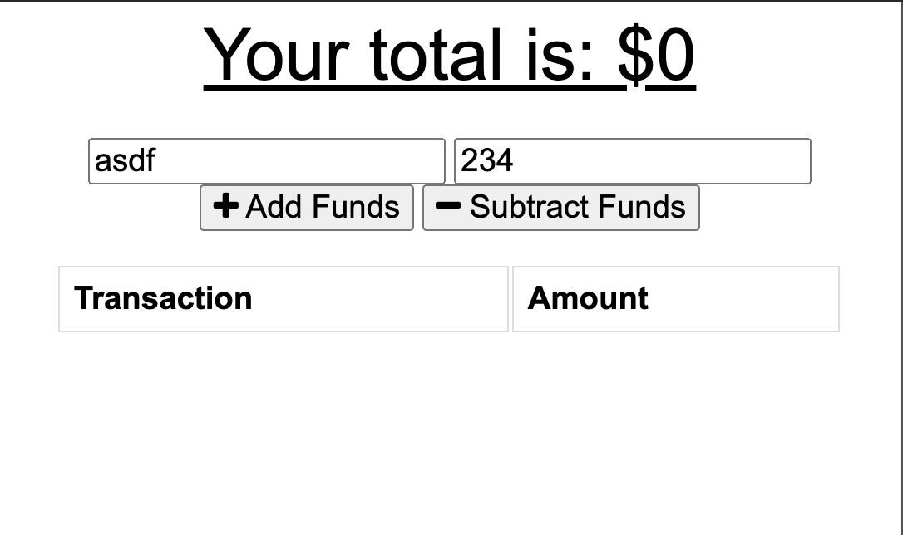

# BudgetTrackPWA
Budget Tracker is a progressive web application that allows users to track their budgets online and offline. When a user enters a transaction while offline, these transactions are stored in the indexedDB, and transferred to the database when the user comes back online. 

## Installation
To install the required dependencies, run npm install

This package assumes there is a MongoDB server running on localhost:27017. If your server is running somewhere else, you can edit server.js to reflect that.

## Usage
To start the server, run npm start. To access the app after starting the server, go to http://localhost:3000 in your browser.

## Questions
If you have any questions about the repo, open an issue or contact CrispyCoder817 directly at brandongmerritt@gmail.com

